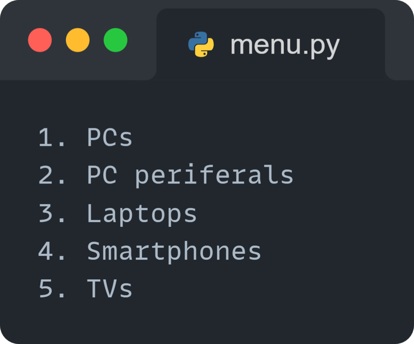
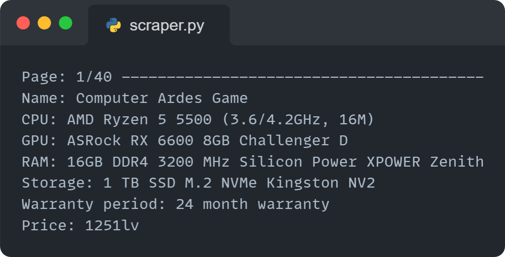
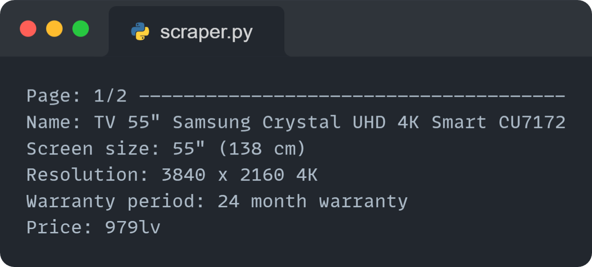

# 2223-10: On the job training (OTJ) project

## 📋 Table of Contents
- [Description](#description)
- [Project Structure](#projectStructure)
- [Used Technologies](#technologies)
- [Usage](#usage)
- [Examples](#example)
- [Author](#author)
- [Acknowledgements](#acknowledgements)

## 🔎 Description 
This project is a web scraper implemented in Python to collect data from an e-commerce website. The program collects product information based on user-selected categories and displays the data in a formatted manner. The scraper uses the BeautifulSoup library for web scraping and requests library for making HTTP requests.

## 🗂️ Used technologies

  
  
  

## 🔩 Project Structure
The project consists of the following files:

- `main.py` Contains the main function that orchestrates the scraping process.
  - It calls other modules to select the product category, update the URL, collect data, and print the collected data.
- `menu.py` Defines menu options and functions for displaying and selecting product categories.
- `url_modification.py` Contains functions to update the URL based on the selected product category and navigate to the next page.
- `scraper.py` Implements the web scraping functionality to collect data from the website.
- `README.md` This file, providing an overview of the project.

## 🖥️ Usage
- Make sure you have `Python` installed on your system.
- Install the required libraries by running `pip install requests and beautifulsoup4` in your terminal.
- Clone the project repository or copy the relevant files to your local directory.
- Run `main.py` using Python: `python main.py`.
- The program will display a menu where you can select the desired product category.
- The scraper will collect data from the website and display it in a formatted manner.
- Use the scroll to navigate through the pages.
- Press Esc to exit the program.

## Examples
*Quick preview of the scraper's output*

  
  
  

## 📖 Author
*Everyone who has participated in the making of this project:*
- [Mihail Petrov](https://github.com/MMPetrov20) - Fullstack Developer

## 🏆 Acknowledgements 
- [Leonard Richardson](https://www.crummy.com/software/BeautifulSoup/) - Developer of `beautifulsoup4`
